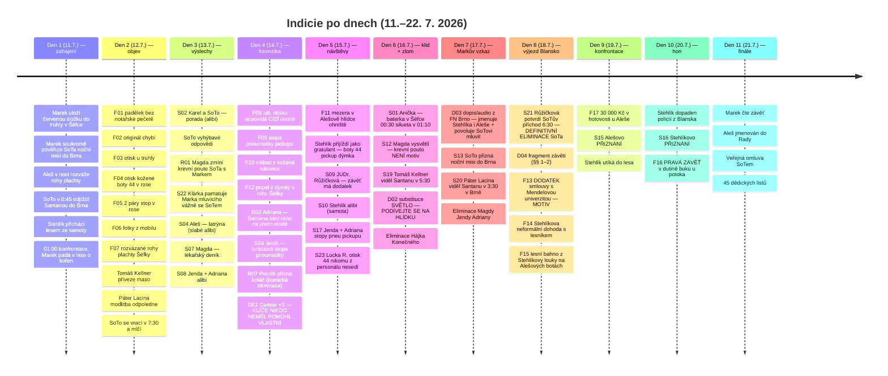
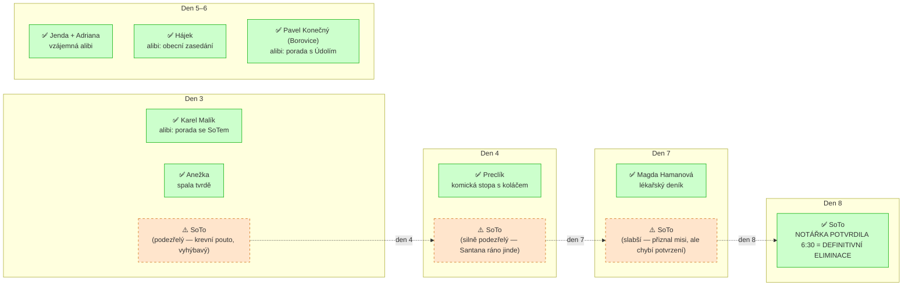
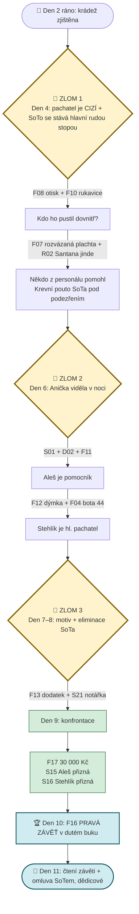

# Přehled indicií — vizuálně

Doplněk k souboru `08_INDICIE_MATICE.md` (textová matice). Tady jsou všechny stopy seřazené **chronologicky**, **graficky vizualizované** a **zvýrazněné podle role v zápletce**.

> **Legenda barev:**
> - 🟥 **červené** = klíčová stopa proti Stehlíkovi (hl. pachatel)
> - 🟧 **oranžové** = klíčová stopa proti Alešovi (pomocník)
> - 🟨 **žluté** = motiv (proč Stehlík jednal)
> - 🟦 **modré** = svědectví / podpůrná stopa
> - ⬜ **šedé** = rudá stopa / eliminace nevinného (zejména SoTo)

---

## 1. Časová osa získávání indicií

---

## 2. Diagram konvergence na pachatele

Které stopy směřují kam — a kdy se „smyčka utáhne":

```mermaid
flowchart LR
    %% Hlavní pachatel
    subgraph STEHLIK["🟥 VLADIMÍR STEHLÍK (hl. pachatel)"]
        S_PHYS["Fyzické stopy v Šéfce a okolí"]
        S_MOTIV["Motiv: pozemek + revír"]
        S_OWN["Vlastní přiznání"]
    end

    %% Pomocník
    subgraph ALES["🟧 ALEŠ TOMEK (pomocník)"]
        A_PHYS["Stopy uvnitř tábora"]
        A_PAY["Úplatek a vydírání"]
        A_OWN["Vlastní přiznání"]
    end

    %% Hlavní rudá stopa
    subgraph SOTO["⬜ TOMÁŠ SOTONIAK (rudá stopa, NEVINNÝ)"]
        SO_BLOOD["Krevní pouto s Markem"]
        SO_KEY["Klíče od všeho"]
        SO_NIGHT["Noční zmizení Santany"]
        SO_CLEAR["Markovo pověření misí — eliminace"]
    end

    %% Stopy směřující ke Stehlíkovi
    F03["F03 otisk u truhly<br/>📅 den 2"]
    F04["F04 kožená bota 44<br/>📅 den 2"]
    F05["F05 2 páry stop v rose<br/>📅 den 2"]
    F08["F08 lab. = CIZÍ osoba<br/>📅 den 4"]
    F09["F09 stopa pneumatiky pickupu<br/>📅 den 4"]
    F10["F10 vlákno z kožené rukavice<br/>📅 den 4"]
    F12["F12 popel z dýmky<br/>(zvláštní směs)<br/>📅 den 4"]
    S01["S01 Anička viděla siluetu<br/>📅 den 6"]
    D03_S["D03 Marek jmenuje Stehlíka<br/>📅 den 7"]
    F13["🟨 F13 DODATEK smlouvy s univerzitou<br/>📅 den 8"]
    F14["🟨 F14 Stehlíkova dohoda s lesníkem<br/>📅 den 8"]
    S16["S16 Stehlíkovo přiznání<br/>📅 den 10"]

    F03 --> S_PHYS
    F04 --> S_PHYS
    F05 --> S_PHYS
    F08 --> S_PHYS
    F09 --> S_PHYS
    F10 --> S_PHYS
    F12 --> S_PHYS
    S01 --> S_PHYS
    F13 --> S_MOTIV
    F14 --> S_MOTIV
    D03_S --> S_PHYS
    S16 --> S_OWN

    %% Stopy směřující k Alešovi
    F07["F07 rozvázané rohy plachty Šéfky<br/>📅 den 2"]
    F11["F11 mezera v Alešově hlídce<br/>(00:30–01:30)<br/>📅 den 5"]
    D01["D01 Caesar — POMOHL VLASTNÍ<br/>📅 den 4"]
    D02["D02 substituce — PODÍVEJTE SE NA HLÍDKU<br/>📅 den 6"]
    D03_A["D03 Marek jmenuje Aleše<br/>📅 den 7"]
    F15["F15 bahno ze Stehlíkovy louky<br/>na Alešových botách<br/>📅 den 8"]
    F17["F17 30 000 Kč u Aleše<br/>📅 den 9"]
    S15["S15 Alešovo přiznání<br/>📅 den 9"]

    F07 --> A_PHYS
    F11 --> A_PHYS
    D01 --> A_PHYS
    D02 --> A_PHYS
    D03_A --> A_PHYS
    F15 --> A_PHYS
    F17 --> A_PAY
    S15 --> A_OWN

    %% Stopy proti SoTovi (rudé stopy)
    R01["R01 krevní pouto<br/>📅 den 3"]
    R02["R02 Santana ráno jinde<br/>📅 den 4"]
    R05["R05 motor v 0:45<br/>📅 den 5"]
    S22_["S22 Klárka pamatuje rozhovor<br/>📅 den 3"]
    S13_["S13 SoTo přizná misi<br/>📅 den 7"]
    S19_["S19 Tomáš Kellner viděl Santanu<br/>📅 den 6"]
    S20_["S20 Páter Lacina viděl Santanu<br/>📅 den 7"]
    S21_["S21 Notářka potvrdí 6:30<br/>📅 den 8 = ELIMINACE"]

    R01 --> SO_BLOOD
    R02 --> SO_NIGHT
    R05 --> SO_NIGHT
    S22_ --> SO_BLOOD
    S13_ --> SO_CLEAR
    S19_ --> SO_CLEAR
    S20_ --> SO_CLEAR
    S21_ --> SO_CLEAR

    %% Klíčový společný okamžik
    F16["🏆 F16 PRAVÁ ZÁVĚŤ v dutině buku<br/>📅 den 10"]
    STEHLIK -.uvedl, kde je.-> F16
    F16 --> FINALE["🎉 FINÁLE den 11 — čtení závěti + omluva SoTem"]

    classDef perp fill:#ffcccc,stroke:#cc0000,stroke-width:2px
    classDef helper fill:#ffe5cc,stroke:#cc6600,stroke-width:2px
    classDef redherring fill:#e0e0e0,stroke:#666,stroke-width:2px
    classDef motive fill:#fff5cc,stroke:#ccaa00,stroke-width:2px
    classDef phys fill:#cce5ff,stroke:#0066cc
    classDef ciph fill:#e5ccff,stroke:#6600cc
    classDef finale fill:#ccffcc,stroke:#00aa00,stroke-width:3px

    class STEHLIK,S_PHYS,S_OWN perp
    class ALES,A_PHYS,A_PAY,A_OWN helper
    class SOTO,SO_BLOOD,SO_KEY,SO_NIGHT,SO_CLEAR redherring
    class F13,F14,S_MOTIV motive
    class F03,F04,F05,F08,F09,F10,F12,S01,F07,F11,F15,F17 phys
    class D01,D02,D03_S,D03_A ciph
    class F16,FINALE finale
```

---

## 3. Diagram eliminace rudých stop

Děti několik dnů sledují **rudé stopy**, které je svedou na špatnou cestu. Tady je přehled, kdy se eliminují:

---

## 4. Souhrnná tabulka indicií

| Den | Kód | Indicie | Kam vede | Hodnota |
|-----|-----|---------|----------|---------|
| 2 | **F01** | Padělek závěti bez pečetě | Krádež je jistá | 🟥 zlomová |
| 2 | F02 | Originál chybí | Krádež je jistá | 🟥 zlomová |
| 2 | **F03** | Otisk dlaně přes rukavici na truhle (neúplný) | → outsider s rukavicemi (Stehlíka konkrétně usvědčí F10 + F12) | 🟥 |
| 2 | **F04** | Otisk kožené boty 44 v rose | → Stehlík (porovnání den 5) | 🟥 |
| 2 | F05 | 2 páry stop v rose | → cizí osoba | 🟥 |
| 2 | F06 | Fotky z mobilu Karla | důkazní archiv | 🟦 |
| 2 | **F07** | Rozvázané rohy plachty Šéfky | → vnitřní pomocník | 🟧 zlomová |
| 3 | S02 | Alibi Karel + SoTo | Karel eliminován | ⬜ |
| 3 | **R01** | Magda zmíní krevní pouto SoTa s Markem | hlavní rudá stopa | ⬜ |
| 3 | **S22** | Klárka pamatuje rozhovor Marka se SoTem | posiluje rudou stopu | ⬜ |
| 3 | S04 | Alešova „latrýna" | slabé alibi | 🟧 |
| 3 | S06 | Anežka — spala tvrdě | eliminace | ⬜ |
| 3 | S07 | Magda — deník | rudá stopa | ⬜ |
| 3 | S08 | Jenda + Adriana alibi + motor v 0:45 | svědci pohybu | 🟦 |
| 4 | **F08** | Lab. otisk = CIZÍ osoba | → cizí pachatel | 🟥 zlomová |
| 4 | **F09** | Stopa pneumatiky pickupu | → Stehlík (den 5) | 🟥 |
| 4 | F10 | Vlákno z kožené rukavice | → Stehlík (rukavice) | 🟥 |
| 4 | **F12** | Popel z dýmky (zvláštní směs) | → Stehlík (kuřácký zvyk) | 🟥 KLÍČOVÁ |
| 4 | **R02** | Adriana — Santana stojí ráno jinde | rudá stopa | ⬜ |
| 4 | **R07** | Preclík přizná koláč | komická eliminace | ⬜ |
| 4 | S24 | Jeník — turistická stopa pneumatiky | potvrzuje F09 | 🟦 |
| 4 | D01 | Caesar — „POMOHL VLASTNÍ" | → vnitřní pomocník | 🟧 |
| 5 | **F11** | Mezera v Alešově hlídce | → Aleš | 🟧 zlomová |
| 5 | Stehlík | Boty 44, pickup, dýmka — VŠECHNO sedí | dramatická shoda | 🟥 |
| 5 | S09 | Závěť má DODATEK | → motiv Stehlíka | 🟨 |
| 5 | S10 | Stehlík tvrdí „byl jsem doma" | LEŽ | 🟥 |
| 5 | S17 | Jenda + Adriana — pneu pickupu | → Stehlík | 🟥 |
| 5 | S23 | Lucka R. — otisk 44 nikomu nesedí | analýza | 🟥 |
| 6 | **S01** | Anička — baterka 00:30 + silueta 01:10 | → cizí + vnitřní | 🟥🟧 zlomová |
| 6 | **S12** | Magda vysvětlí — krevní pouto NENÍ motiv | slábne rudá stopa SoTa | ⬜ |
| 6 | **S19** | Tomáš Kellner viděl Santanu v 5:30 | eliminace SoTa (předzvěst) | ⬜ |
| 6 | D02 | Substituce — „PODÍVEJTE SE NA HLÍDKU" | → Aleš | 🟧 |
| 6 | elim. | Hájek, Konečný eliminováni | rudé stopy uzavřeny | ⬜ |
| 7 | **D03** | Markův vzkaz z FN Brno — jmenuje Stehlíka i Aleše + povoluje SoTovi mluvit | → oba + uvolňuje SoTa | 🟥🟧 zlomová |
| 7 | **S13** | SoTo přizná noční misi do Brna | eliminace SoTa (předzvěst) | ⬜ |
| 7 | **S20** | Páter Lacina viděl Santanu v 3:30 v Brně | eliminace SoTa | ⬜ |
| 7 | elim. | Magda, Jenda, Adriana | rudé stopy uzavřeny | ⬜ |
| 8 | **S21** | Notářka Růžičková potvrdí SoTův příchod 6:30 | DEFINITIVNÍ ELIMINACE SoTa | ⬜ |
| 8 | D04 | Fragment závěti (§§ 1–2) | kontext | 🟦 |
| 8 | **F13** | DODATEK smlouvy s univerzitou | → motiv Stehlíka | 🟨 KLÍČOVÝ MOTIV |
| 8 | F14 | Stehlíkova dohoda s lesníkem | → motiv | 🟨 |
| 8 | F15 | Bahno ze Stehlíkovy louky na Alešových botách | → Aleš tam byl | 🟧 |
| 9 | **F17** | 30 000 Kč u Aleše | úplatek od Stehlíka | 🟧 zlomová |
| 9 | **S15** | Alešovo přiznání | DEFINITIVNÍ | 🟧 finální |
| 10 | **S16** | Stehlíkovo přiznání | DEFINITIVNÍ | 🟥 finální |
| 10 | **F16** | PRAVÁ ZÁVĚŤ v dutině buku | triumfální moment | 🏆 |

---

## 5. Tři klíčové momenty zlomu

---

## 6. Indicie podle týmu (kdo má co exkluzivně)

Některé stopy dostane **každý tým** (společné), jiné jdou **jen 1–2 týmům** — to drží napětí a podporuje vzájemné sdílení.

| Stopa | Distribuce | Poznámka |
|---|---|---|
| F01–F07, F08, F09, F10, F12 | všechny týmy | místo činu, forenzní stanoviště |
| D01, D02, D03 | všechny týmy | dešifrovává nejrychlejší tým, ale obsah dostanou všichni |
| **F11** mezera v Alešově hlídce | **1–2 týmy** (kdo den 5 pracuje s Alešem) | exkluzivní |
| **F13/F14** dodatek smlouvy + dohoda s lesníkem | **výjezdová skupina** den 8 (1 dítě z týmu) | sdílí se po návratu |
| **F15** bahno na Alešových botách | **1 tým** (kdo den 8 zkoumá Aleše) | exkluzivní |
| **R01/R02** rudá stopa proti SoTovi | tým, který den 3 mluví s Magdou (R01) + tým u stanoviště C den 4 (R02) | exkluzivní rudé stopy |
| **S22** Klárka pamatuje | tým Jestřábi (její vlastní tým) | exkluzivní |
| **S23** Lucka R. analýza | tým Vlci (její vlastní tým) | exkluzivní |
| **S24** Jeník turistika | tým Lišky (jeho vlastní tým) | exkluzivní |
| **S19/S20** Kellner / Páter | tým, který den 6/7 s nimi mluví | exkluzivní |

> **Tip pro vedoucího**: pokud nějaký tým výrazně zaostává, **prohoďte exkluzivní stopu** — nedostane ji „přední" tým, dostane ji „zadní". Není to o body, je to o zážitku.

---

## 7. Jak diagram použít

- **Pro vedoucího hry**: tato vizualizace ukazuje, **kdy která stopa přijde do hry** — pomáhá držet tempo. Pokud tým je v dni 7 ještě bez podezření na Stehlíka, stopa **F13 (dodatek smlouvy) den 8** to napraví.
- **Pro děti**: **NEUKAZUJTE jim tento přehled**. Stopy mají objevovat. Lze ale pověsit „šifrovou tabuli" v jídelně, na kterou se postupně přilepuje **pouze to, co děti samy našly** (= kontextová tabule).
- **Pro Knihu 30 let**: na konci tábora lze do knihy vlepit zjednodušenou verzi tohoto diagramu — jako **dokumentaci, jak děti pravdu rozkrývaly**.
